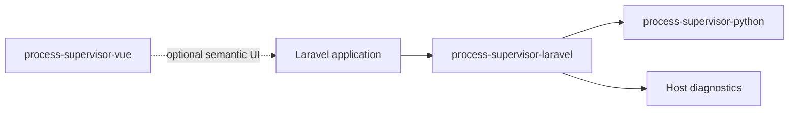
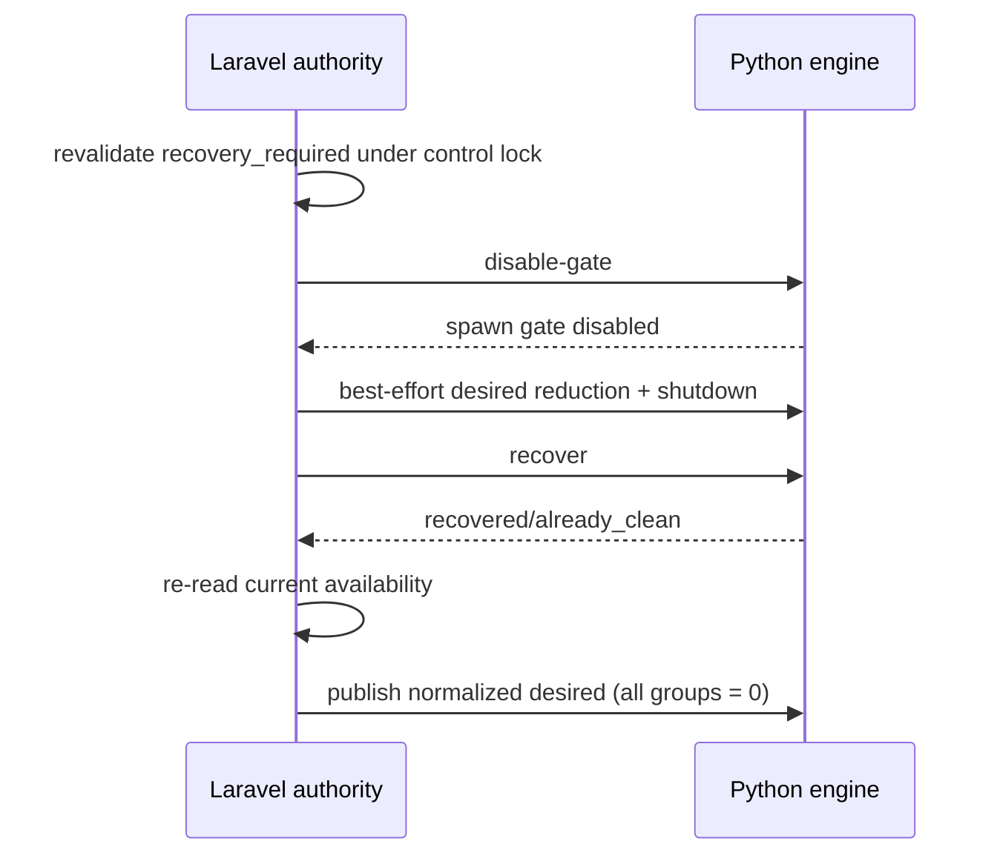

# process-supervisor-laravel

Laravel control plane and installer for the Process Supervisor family.

This package sits between an application and `process-supervisor-python`. Laravel remains authoritative for product configuration, authorization and user-facing operations; Python owns only OS/process lifecycle.



## Requirements

- PHP 8.4+
- Laravel 12 or 13
- `uv` plus a Python 3.10+ interpreter for the managed engine
- Reverb only when the application wants the Reverb workload group; `laravel/reverb` is intentionally optional

The package declares `symfony/process` directly because it executes the closed Python control CLI itself rather than relying on Laravel's transitive dependency graph.

## Install

When the package is available through your Composer repository/Packagist:

```bash
composer require simone-bianco/process-supervisor-laravel
php artisan process-supervisor:install
```

Before Packagist publication you can register the GitHub repository explicitly:

```bash
composer config repositories.process-supervisor-laravel vcs https://github.com/simone-bianco/process-supervisor-laravel
composer require simone-bianco/process-supervisor-laravel:dev-main
php artisan process-supervisor:install
```

The interactive installer explains each step in English and asks before modifying application files. It can optionally:

- publish `config/process-supervisor.php`
- add missing recommended `.env` defaults
- create/synchronize the dedicated Python venv
- add root Composer post-install/post-update synchronization hooks
- install the optional Vue package with npm

The tool remains disabled by default until the host chooses to enable it.

## Commands

```text
php artisan process-supervisor:install
php artisan process-supervisor:sync-python
php artisan process-supervisor:control status
php artisan process-supervisor:control recover
php artisan process-supervisor:control start <group>
php artisan process-supervisor:control stop <group>
php artisan process-supervisor:control restart <group>
php artisan process-supervisor:control start-all
php artisan process-supervisor:control probe <group>
php artisan process-supervisor:control client
```

`process-supervisor:control` is deliberately semantic. It does not expose arbitrary command execution.

## Host contracts

Applications may replace four small contracts:

- `AvailabilityProvider`
- `TimezoneProvider`
- `ReverbPortProvider`
- `DiagnosticsSink`

Default implementations use config/logging. Local GPT replaces them with database Settings and Laravel Diagnostics adapters.

## Python runtime

The package owns a dedicated application venv, by default under:

```text
storage/framework/process-supervisor/python-venv
```

`process-supervisor:sync-python` uses `uv`, installs/upgrades `process-supervisor-python`, verifies the import, and runs the Python `doctor` command before reporting success.

## Recovery contract

Recovery is intentionally guarded:



A direct recovery request against a healthy runtime is rejected instead of resetting capacity.

## Optional Vue UI

```bash
npm install @simone-bianco/process-supervisor-vue
```

Until npm publication:

```bash
npm install github:simone-bianco/process-supervisor-vue
```

The Vue package is optional and contains presentation only.

## Documentation

- [`z-docs/installation.md`](z-docs/installation.md)
- [`z-docs/architecture.md`](z-docs/architecture.md)