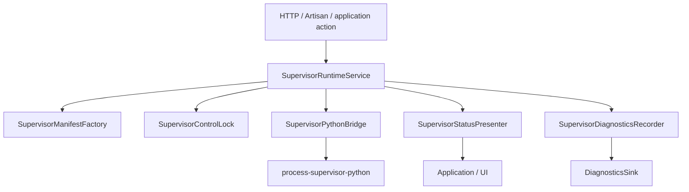
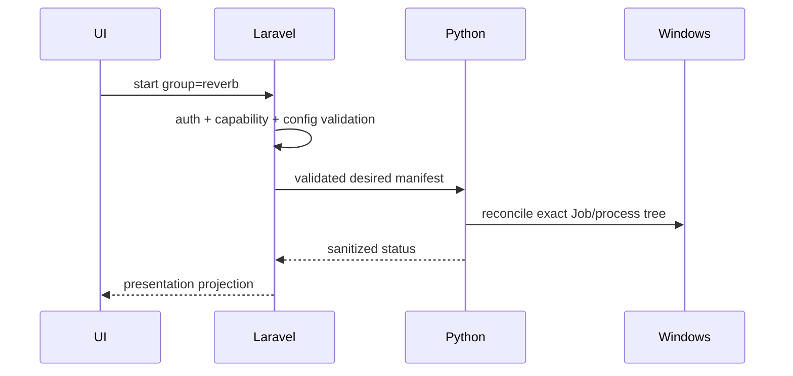

# Laravel package architecture

`process-supervisor-laravel` is the application control plane. It decides **whether an operation is allowed and what desired state should be sent**. The Python package decides how to realize that desired state safely at OS level.

## Main flow

## Responsibilities

### Laravel owns

- product enable/disable state
- validated configuration
- PHP CLI resolution
- Queue/Scheduler/Reverb manifest construction
- Reverb port preflight
- authorization at the application boundary
- recovery eligibility and final desired normalization
- operator diagnostics

### Python owns

- resident lifecycle
- Windows Job Object ownership
- child process creation/containment
- runtime authority files
- scheduler minute claims
- crash/backoff accounting
- authority recovery/salvage

## Why the boundary matters

The browser never chooses an executable, argv, cwd or environment. It sends semantic intent such as “start Reverb”. Laravel validates that intent and generates the fixed process contract.

## Recovery serialization

Recovery is destructive authority work, so it is revalidated inside the Laravel control lock and the Python engine applies its own recovery/transition/resident mutex hierarchy. Both layers intentionally fail closed when their authority cannot be proven.