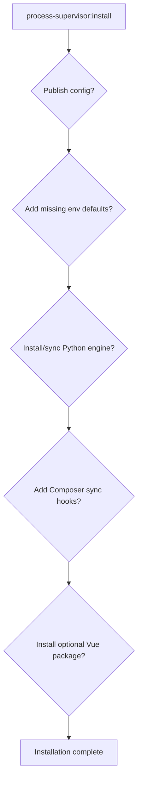
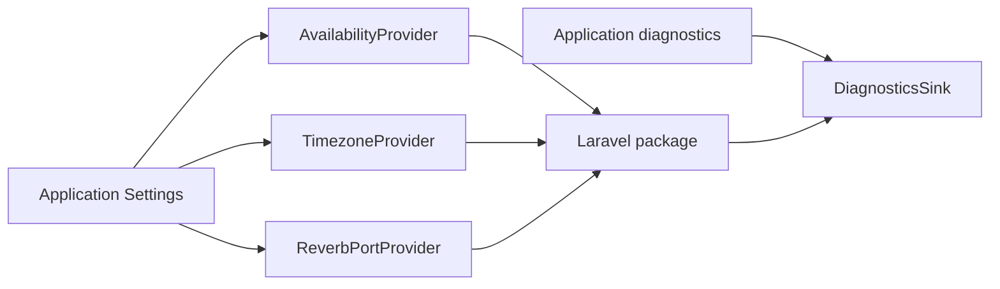

# Installation and host integration

## Installer flow

`process-supervisor:install` is intentionally interactive. It explains what each action changes before asking for confirmation.



No application file is modified silently by the installer.

## Python requirements

The Python engine installer expects:

- Python supported by `uv`
- `uv` available on PATH or configured through `PROCESS_SUPERVISOR_UV_BINARY`
- a Windows host for the current v1 runtime

The venv path can be changed with `PROCESS_SUPERVISOR_PYTHON_VENV`.

## Recommended environment defaults

The installer can add these only when they are missing:

```env
PROCESS_SUPERVISOR_ENABLED=false
PROCESS_SUPERVISOR_REVERB_PORT=8080
```

Existing values are preserved.

## Composer synchronization

If accepted, the installer adds this command to root `post-install-cmd` and `post-update-cmd`:

```text
@php artisan process-supervisor:sync-python --no-interaction
```

This keeps the Python engine synchronized with Composer deployments without turning Python into a fake Composer dependency.

## Custom host authority

A host application can bind its own implementations for availability, timezone, Reverb port and diagnostics.



This is how Local GPT uses database-backed Settings while the standalone package can still operate with config defaults.